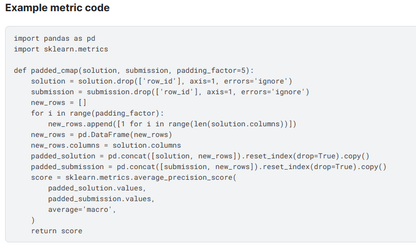

# CompetitionExperience

#### Kaggle - BirdCLEF 2023
2023.2 - 2023.5

成绩: 

地址: <a href="https://www.kaggle.com/competitions/birdclef-2023">BirdCLEF 2023</a>

类型: 音频分类

任务: 在本次比赛中，您将使用机器学习技能通过声音识别东非鸟类。

评估指标:

方案:
- Mel图 + PCEN
- Mixup + Cutmix
- ConvNext、ConvNextV2、ImageBind
- Adan
- Cosine Learning + Warmup($\frac{1}{6}$Epoch)
- BCELoss + OHEM
- accelerate train(Multi GPU、FP16)
- SWA
  

明显提点技巧:
- 数据增强（mixup）
- SWA
- 权重平均融合

参考文献:
- [Kaggle 讨论区](https://www.kaggle.com/competitions/birdclef-2023/discussion?sort=votes)
- [PCEN](https://github.com/librosa/librosa/issues/615)
- [SWA](https://pytorch.org/docs/stable/optim.html#stochastic-weight-averaging)
____
